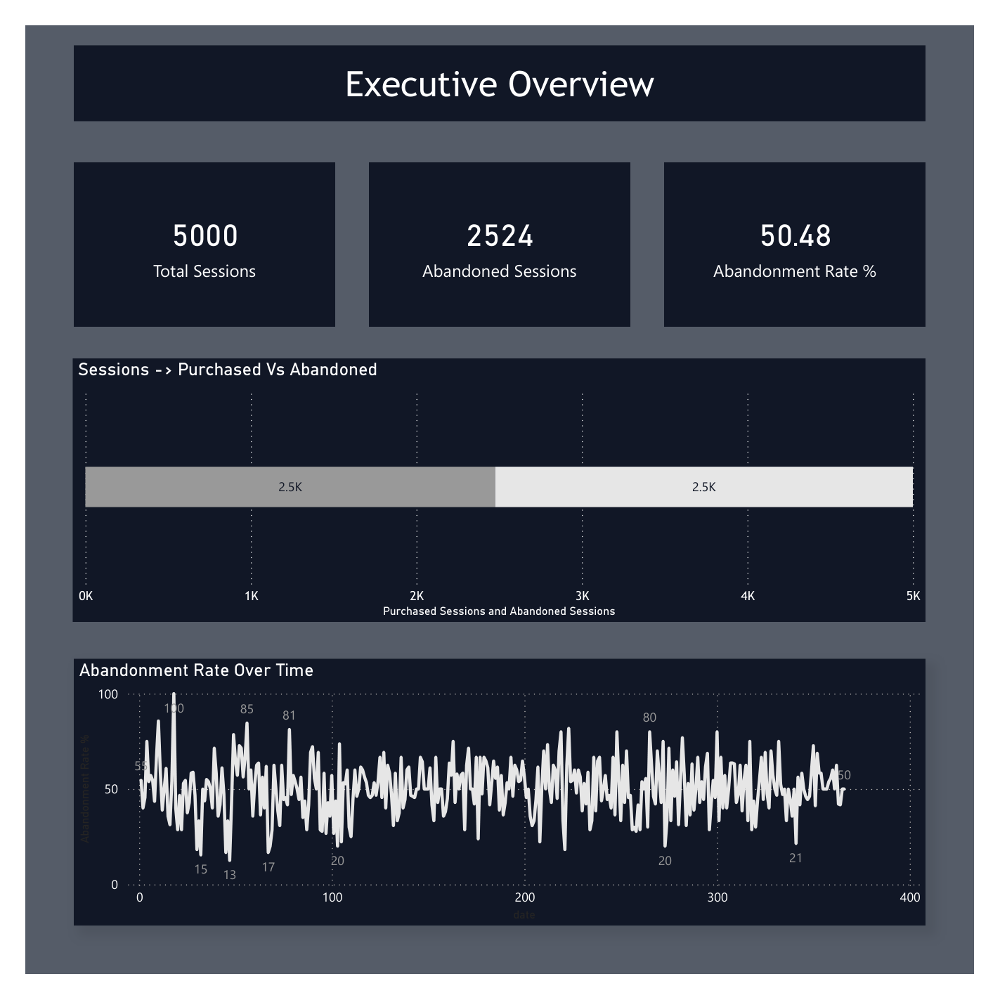
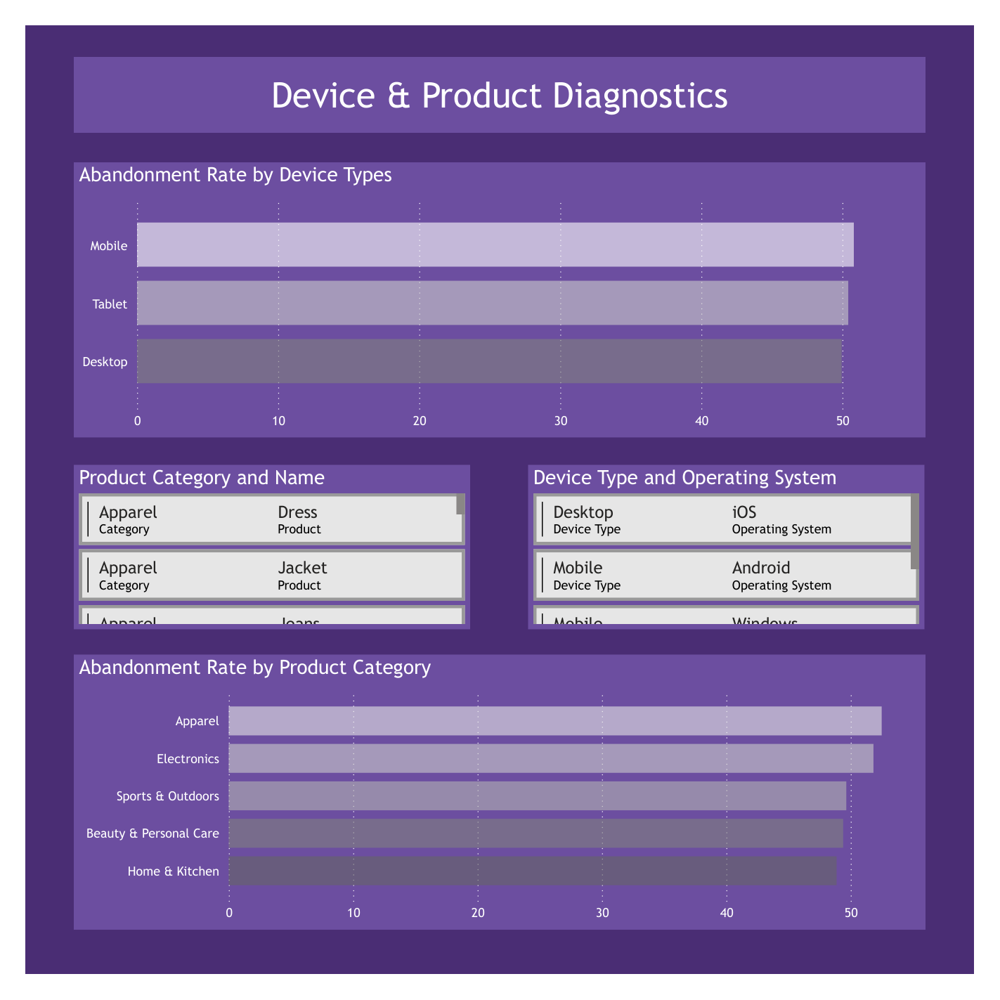
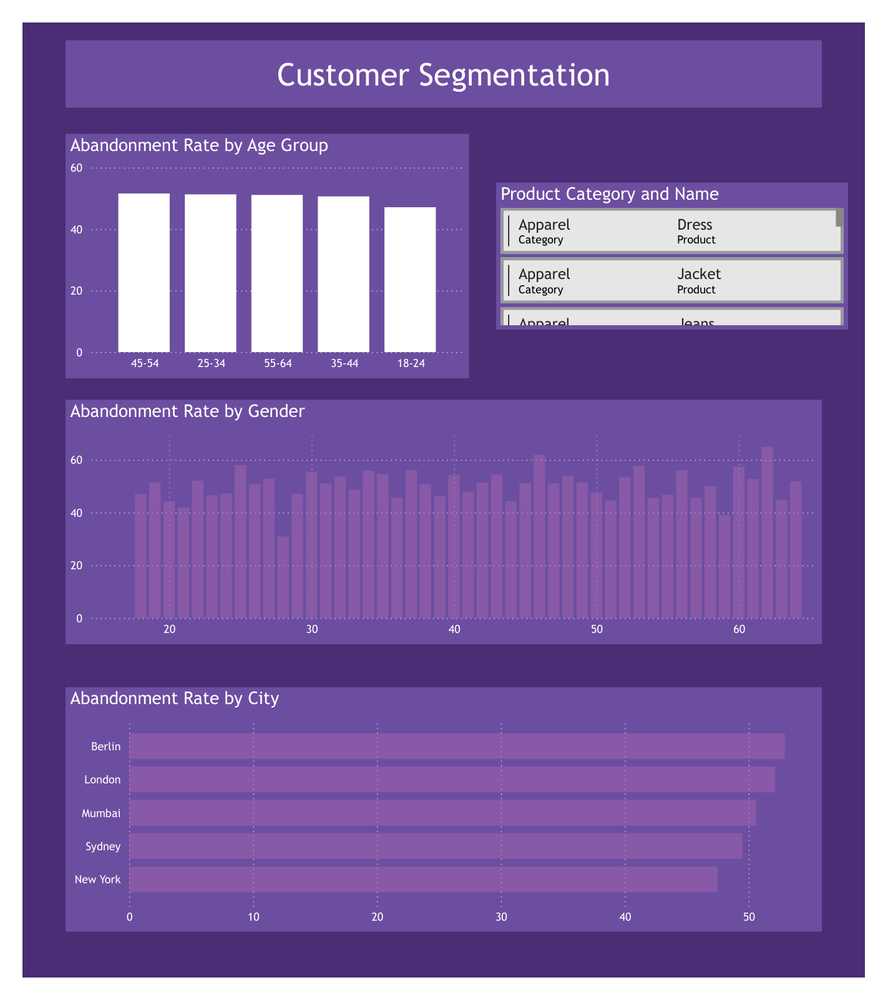

# 📊 Cart Abandonment Analysis Project

**One-line summary:** Analyzed eCommerce cart abandonment data to identify key factors driving customer drop-off and developed data-driven strategies to recover $392K in lost revenue.

---

## 🚩 1. Problem Statement

- **What real-world/business problem are you solving?**  
  eCommerce business experiencing 50.48% cart abandonment rate, losing significant revenue from customers who add items to cart but don't complete purchase.

- **Who would benefit from this analysis?**  
  eCommerce managers, marketing teams, UX designers, and business executives looking to optimize conversion rates and revenue.

- **What decisions will this project help make?**  
  Mobile UX improvements, apparel category enhancements, geographic localization strategies, and targeted recovery campaigns for high-intent customers.

---

## 📂 2. Data Overview

**Data Source**
- Company dataset (simulated eCommerce transaction data)
- 5,000 rows × 8 columns in fact table, plus 4 dimension tables
- Time period covered: 2023-2024 (366 days)

**Features Used**
- **fact_table**: session_id, customer_id, product_id, device_id, date_id, quantity, abandon_date, abandon_time
- **customer_table**: customer_id, age, gender, city  
- **product_table**: product_id, category, price
- **device_table**: device_id, device_type, os
- **date_table**: date_id, date
- **Target variable**: is_abandoned (engineered feature)

**Data Challenges**
- Missing values in abandon_date and abandon_time (2,476 null records)
- Inconsistent data types requiring conversion
- Need for referential integrity validation across dimension tables
- Feature engineering required for abandonment flag creation

---

## 🛠 3. Tools & Technologies

- **Python** - Data processing and ETL pipeline
- **Pandas, NumPy** - Data manipulation and analysis
- **SQL** - Advanced analytics and metrics calculation
- **Power BI** - Interactive dashboard creation
- **Jupyter Notebook** - Exploratory analysis
- **Pickle** - Data serialization for efficiency

---

## 🧹 4. Data Cleaning & Preparation

- **Removed duplicates** - Verified unique session_ids and customer relationships
- **Handled missing values** - Created is_abandoned flag based on abandon_date presence (0 if completed, 1 if abandoned)
- **Converted data types** - Standardized datetime fields, string types, and numeric columns
- **Feature engineering:**
  - Created `is_abandoned` column from abandon_date null/non-null logic
  - Extracted age groups for demographic analysis (18-24, 25-34, 35-44, 45-54, 55-64)
  - Validated referential integrity across all dimension tables (100% consistency achieved)

---

## 🔍 5. Exploratory Data Analysis

Key questions answered:

1. **What is the overall abandonment trend?**  
   50.48% overall abandonment rate across 5,000 sessions

2. **Which device contributes most to abandonment?**  
   Mobile devices show highest abandonment at 50.82%

3. **Is there correlation between product category and abandonment?**  
   Apparel category has highest abandonment at 52.50%

**Sample Insights**

- **Mobile UX Crisis**: 50.82% abandonment rate indicates checkout friction on mobile devices
- **Apparel Category Leakage**: 52.50% abandonment suggests sizing/pricing issues
- **Geographic Disparities**: Berlin (52.91%) and London (52.15%) show highest regional abandonment
- **High-Intent Opportunity**: 1,508 users abandoned carts with 3+ items, representing $392K recovery potential

---

## 🤖 6. Approach / Methodology

1. **Defined business objective** - Reduce cart abandonment and recover revenue
2. **Cleaned and transformed data** - Built ETL pipeline with validation checks
3. **Performed EDA** - Multi-dimensional analysis across devices, products, demographics
4. **Applied analytics technique:**
   - SQL-based dashboard analytics with JOIN operations and aggregations
   - Power BI visualization for executive reporting
5. **Evaluated results** - Quantified revenue opportunities and strategic recommendations

---

## 📈 7. Key Findings

- **Finding 1**: Mobile devices show 50.82% abandonment rate, 0.87% higher than desktop
- **Finding 2**: Apparel category experiences 52.50% abandonment, 3.63% above overall average  
- **Finding 3**: Berlin market has 52.91% abandonment, 5.43% higher than best-performing New York (47.49%)
- **Finding 4**: 1,508 high-intent customers (3+ items) represent immediate $392,830 recovery opportunity

> Customers using mobile devices abandon carts 0.87% more frequently than desktop users, indicating critical UX optimization needs.

---

## 💡 8. Business Recommendations

- **Mobile Checkout Simplification** - Reduce form fields by 40%, implement one-click payment
- **Apparel Category Enhancement** - Add interactive size guides and virtual try-on features  
- **Berlin Market Localization** - Implement local payment methods (Sofort, Giropay) and German language support
- **High-Intent Recovery Campaigns** - Target 1,508 users with 3+ items through email sequences and retargeting ads

---

## 📊 9. Results / Impact

- **Revenue recovery potential**: $392,830 from high-intent customers
- **Process time reduction**: From manual analysis to automated dashboard (estimated 80% time savings)
- **Decision enablement**: 4 strategic initiatives prioritized with clear ROI metrics
- **Stakeholder alignment**: Executive dashboard provides real-time abandonment monitoring

---

## 📚 10. What I Learned

- **Technical skills**: Advanced SQL with complex JOINs, Power BI dashboard design, Python ETL pipeline development
- **Business understanding**: Cart abandonment psychology, mobile UX impact, geographic market differences
- **Challenges faced and how you solved them**: 
  - Data inconsistency across tables → Implemented referential integrity validation
  - Missing abandonment indicators → Created engineered is_abandoned feature
  - Complex multi-dimensional analysis → Developed star schema architecture

---

## 🚀 11. Future Improvements

- **Add more recent data** - Extend time period for seasonal trend analysis
- **Build ML model** - Predictive abandonment model for real-time intervention
- **Deploy dashboard** - Cloud-based Power BI service for automated reporting
- **Automate pipeline** - Schedule ETL process for daily data refresh

---

## 📎 12. Project Files

- `Cart Abandonment Datasets/` – Raw CSV datasets (5 tables)
- `Cleaned_Datasets/` – Processed and validated data
- `data_processing.ipynb` – ETL pipeline and data cleaning
- `demograph.sql` – SQL analytics queries (15+ analytical queries)
- `cart.pbix` – Power BI interactive dashboard
- `variables.pkl` – Serialized DataFrames for quick loading
- `Screenshots/` – Dashboard visual exports

---